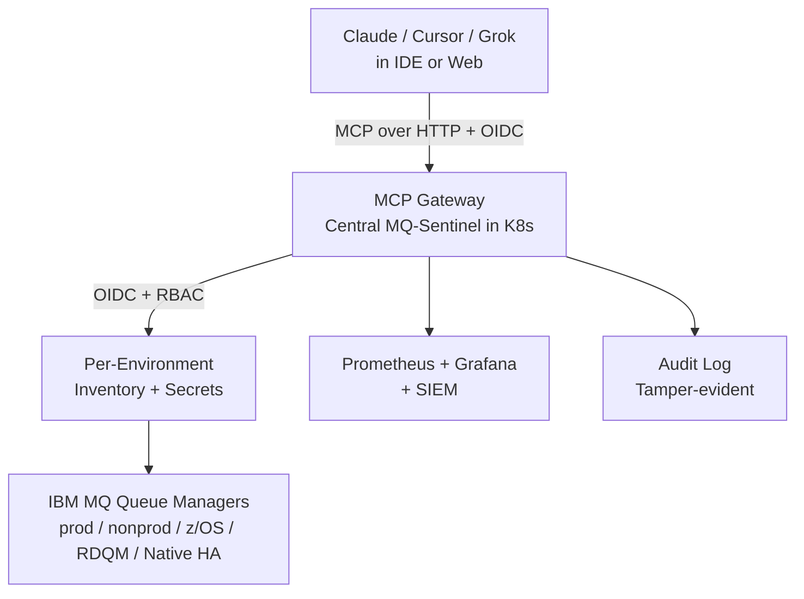

# Getting Started for Platform Teams

This guide is for SREs, platform engineers, and MQ administrators who need to deploy and operate MQ-Sentinel in a production environment.

## Prerequisites

- Kubernetes cluster (or RHEL/Rocky for package install)
- Access to IBM MQ Queue Managers (client libs or bring-your-own)
- OIDC provider (Okta, Entra ID, Keycloak, etc.)
- Prometheus + Grafana (recommended)

## Quick Start (Kubernetes)

1. Clone the repo or use the Helm chart directly.

```bash
helm repo add mq-sentinel oci://ghcr.io/pramodreddyboddu/charts
helm install mq-sentinel mq-sentinel/mq-sentinel \
  --set oidc.issuer=https://your-idp/... \
  --set oidc.audience=mq-sentinel \
  --set oidc.jwksUrl=https://your-idp/.../keys
```

2. Create inventory ConfigMap.

```bash
kubectl create configmap mq-sentinel-inventory --from-file=inventory.yaml
```

3. Deploy with production values.

See `values-production.yaml` example.

4. Verify.

```bash
kubectl port-forward svc/mq-sentinel 8080:8080
curl http://localhost:8080/healthz
```

## Connecting Your AI Agent

For Claude Desktop / Cursor / Grok / Gemini / ChatGPT:

Copy-paste configs live in [Connect to any MCP client](mcp-clients.md). There is no npm package `@modelcontextprotocol/server-mq-sentinel`.

Local demo (stdio):

```json
{
  "mcpServers": {
    "mq-sentinel": {
      "command": "uv",
      "args": ["run", "--directory", "/ABS/PATH/TO/mq-sentinel", "mq-sentinel", "serve"],
      "env": {
        "MQS_AUTH_DISABLE_AUTH_FOR_LOCAL_DEV": "true",
        "MQS_SERVER_ENVIRONMENT": "dev"
      }
    }
  }
}
```

For production / ChatGPT: HTTP transport with OIDC (`docs/http-transport.md`). Point the client at your internal HTTPS endpoint with a Bearer token.

## Onboarding a New Queue Manager

See the dedicated runbook: [How to Onboard a New Queue Manager](onboard-new-qm.md)

## Monitoring Setup

1. Deploy the ServiceMonitor if using Prometheus Operator.
2. Import the Grafana dashboard from `observability/grafana-dashboard.json`.
3. Set up the alerts from `observability/prometheus-alerts.yaml`.

## Security Hardening Checklist

- [ ] Use production OIDC (no dev mode)
- [ ] Restrict NetworkPolicy to QM subnets only
- [ ] Use external secrets for credentials
- [ ] Enable audit log shipping
- [ ] Review RBAC groups in your IdP
- [ ] Run `make ci` and security tests before upgrades

## Architecture Overview (Enterprise)



- Central deployment recommended for large orgs.
- One instance per major environment or a shared fleet with strong RBAC.
- All MQ access is read-only.

## Next Steps

- Read full [Production Guide](PRODUCTION.md)
- Review [Org Readiness Plan](ORG-READINESS-PLAN.md)
- Join the community for questions

For production support or enterprise features, see the roadmap in the main README.